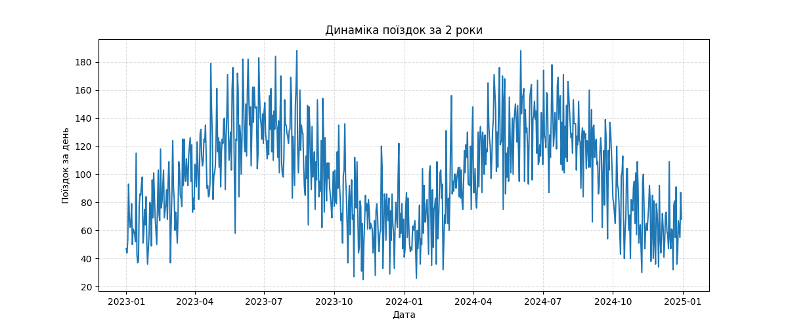
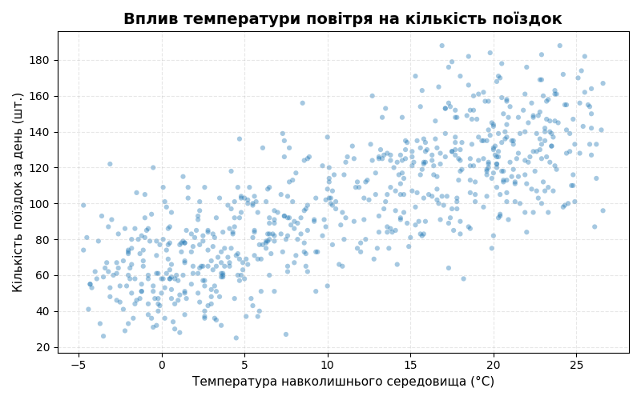
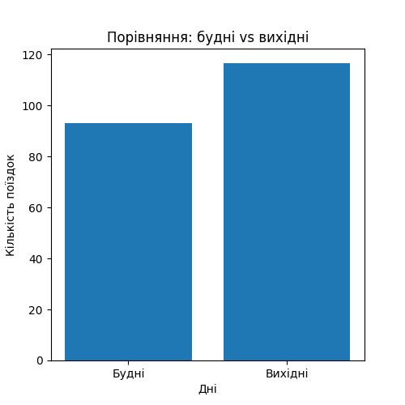
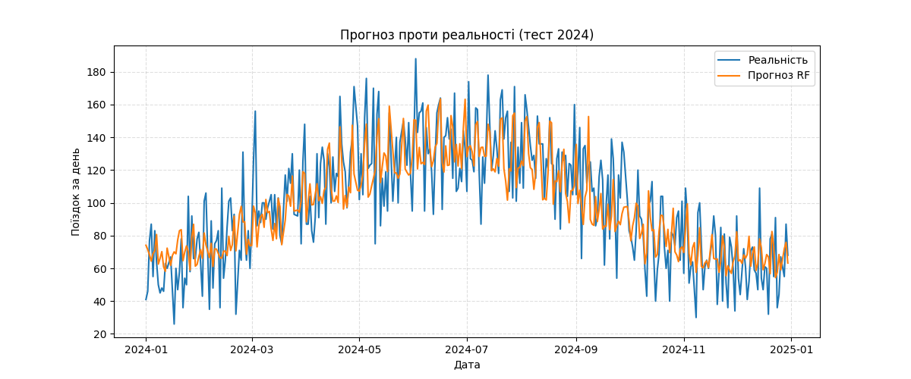

# CityBikes — Daily Demand Forecasting

> Read in [Ukrainian](README.uk.md)

Forecasting daily bike-share ride volume from weather and calendar features. Full pipeline: exploration of an undocumented database → data cleaning → feature engineering → modelling → visualisation.

### Data

> **Note on the data.** The dataset is synthetic — generated with an LLM as a self-set training exercise in SQL, data cleaning and time-series modelling. Realistic data-quality issues (mixed date formats, duplicates, impossible values, missing days, orphaned foreign keys) were deliberately injected; their location and volume were unknown in advance, so the exploration and cleaning stages were performed blind, as with a genuinely unfamiliar database.


SQLite database `citybikes.db`, 5 tables, 2 years of observations (2023–2024), no documentation — schema reconstructed independently via `sqlite_master` and `PRAGMA table_info`.

| Table | Contents |
|---|---|
| `rides` | Trips (~73k): bike, user, stations, timestamps, distance, duration |
| `weather` | Daily weather: temperature, precipitation, wind |
| `stations` | Rental stations |
| `bikes` | Bicycles |
| `users` | Users |

For the stated task (total daily demand) only `rides` + `weather` were used. `stations`, `bikes` and `users` were deliberately excluded — they do not affect the daily aggregate.

### Data Cleaning

Every cleaning decision was made against one criterion: **does this issue affect the target variable?**

| Issue | Scale | Decision | Rationale |
|---|---|---|---|
| Negative precipitation (`-5.0`) | 10 records | Replaced with `NaN` + linear interpolation | Physically impossible; weather is a smooth time series, adjacent days correlate |
| Duplicate rides | 150 records | Removed via composite key including timestamps | Duplicates **inflate the target variable** — they directly corrupt the forecast |
| Mixed date formats | — | Converted to `datetime` | Required for calendar features and a correct split |
| Orphaned `user_id` | ~2% | **Kept** | `users` table unused; the ride itself is a valid event |
| Anomalous durations | ~1.5% | **Kept** | Does not affect the daily ride count |

**Key finding.** The initial duplicate key (excluding timestamps) falsely flagged 161 records. Adding `start_time` / `end_time` yielded the correct 150 — preserving 11 genuine rides (same user, route and bike, but different times) from erroneous deletion.

Verification: `72,879 → 72,729` rows; the difference matches the number of duplicates found.

### Dataset Preparation

- Aggregated `rides` into a daily series → target variable `trips_count`
- `INNER JOIN` with weather: `730 → 707` days (23 days lost to gaps in meteorological data — a deliberate trade-off, as such days are unusable for a weather-driven model)
- Calendar features: `month`, `day_of_the_week`
- **Chronological split, not random:** train — 2023, test — 2024. Prevents data leakage, critical for time series

### Results

| Model | RMSE | MAE | R² |
|---|---|---|---|
| Linear Regression | 21.36 | 17.39 | 0.639 |
| Random Forest | **20.98** | **17.21** | **0.652** |

Feature importance (Random Forest):

| Feature | Weight |
|---|---|
| `temp_c` | **0.727** |
| `day_of_the_week` | 0.127 |
| `wind_kmh` | 0.077 |
| `precip_mm` | 0.040 |
| `month` | 0.029 |

**Interpretation.** Temperature accounts for ~73% of feature importance — the model independently identified the primary physical driver of bike-share demand. The `month` feature proved redundant: seasonality is already encoded in temperature. The marginal advantage of Random Forest over linear regression indicates a largely linear relationship.

### Visualisations

1. **Ride volume over 2 years**
   
   _Finding: a clear seasonal cycle repeats in both years — demand climbs from a winter low (~40–60 trips/day) to a summer peak (~150–190 trips/day) around June–August, then declines again. The pattern repeating consistently across two independent years confirms it's driven by a recurring external factor (weather/season), not noise._

2. **Temperature dependency**
   
   _Finding: a positive, fairly linear relationship up to ~20°C, after which the curve flattens — additional warmth above that threshold doesn't drive further ridership. This matches the feature importance result (temp_c = 0.727) and explains why Random Forest only marginally beat Linear Regression: the underlying relationship is close to linear, with a plateau at the top end._

3. **Weekdays vs weekends**
   
   _Finding: weekends average ~117 trips/day versus ~93 on weekdays — about 25% higher. This points to demand being driven more by leisure/recreational riding than commuter traffic, which runs counter to the usual default assumption for bike-share systems._

4. **Predicted vs actual on test set**
   
   _Finding: the model tracks the seasonal trend and general level well, but smooths over day-to-day volatility — it underestimates sharp spikes (e.g. the ~188-trip peak around June 2024) and overestimates some low troughs. Expected, since one-off spikes are likely driven by events (weather anomalies, holidays) not captured by the current feature set (month, day-of-week, weather only)._

### Stack

`Python` · `pandas` · `NumPy` · `SQLite` · `scikit-learn` · `matplotlib`

### Running

```bash
pip install pandas numpy scikit-learn matplotlib
python main.py
```
